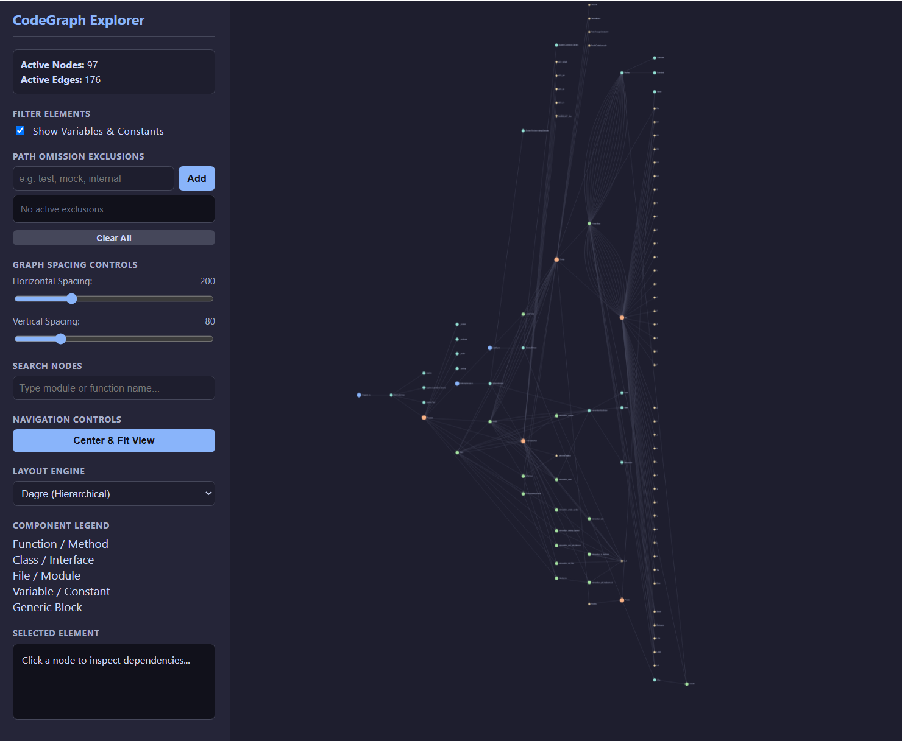
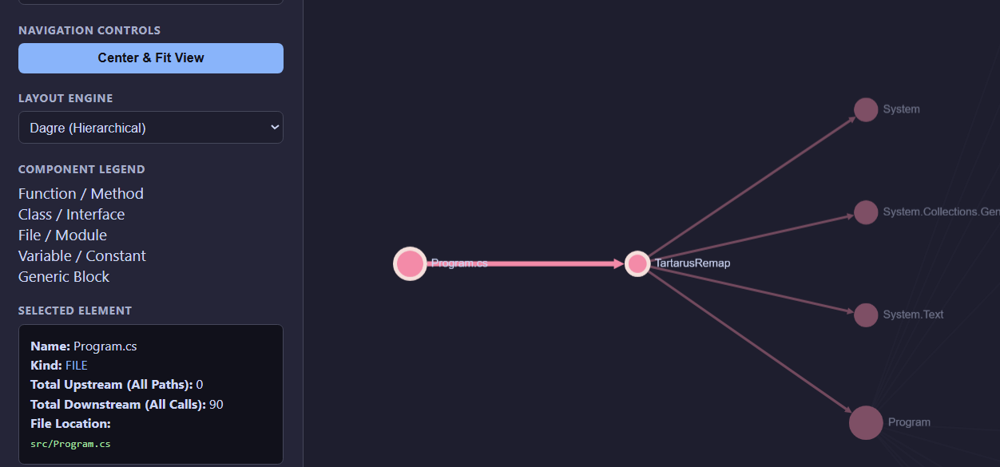
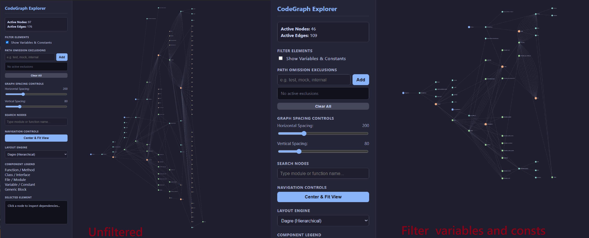

# export-to-cytoscape

Turns a CodeGraph `codegraph.db` index into a Cytoscape.js JSON graph and serves a small browser
UI for exploring it.

Two pieces:

- `export-cytoscape.js` — Node script. Reads `import/codegraph.db` (read-only) and writes
  `cytoscape-graph.json`.
- `index.html` + `app-visualizer.js` — static page that fetches that JSON and renders it with
  Cytoscape.js.



## Requirements

- Node.js 20+ (developed on v24)
- A `codegraph.db` produced by CodeGraph indexing the repo you want to look at

## Setup

```bash
npm install
```

This installs `sqlite3` (used by the exporter) plus `cytoscape` and `cytoscape-dagre`.

The browser page loads Cytoscape from vendored copies at the repo root rather than from
`node_modules`, so the static server doesn't need to expose `node_modules`. Those copies are
checked in; refresh them after upgrading the dependencies:

```bash
cp node_modules/cytoscape/dist/cytoscape.min.js ./cytoscape.min.js
cp node_modules/cytoscape-dagre/dist/cytoscape-dagre.min.js ./cytoscape-dagre.js
```

## Usage

1. Copy the CodeGraph database of the project you want to explore into `import/`:

   ```bash
   mkdir -p import
   cp /path/to/your-project/.codegraph/codegraph.db import/
   ```

   The path is hardcoded to `import/codegraph.db` relative to the current working directory.

2. Export:

   ```bash
   node export-cytoscape.js
   ```

   Writes `cytoscape-graph.json` and prints how many nodes and edges were kept versus discarded.

3. Serve and open:

   ```bash
   npx serve .
   ```

   Open the printed URL (usually <http://localhost:3000>). The page must be served over HTTP —
   opening `index.html` as a `file://` URL fails, because the JSON is loaded with `fetch`.

## What the exporter does

Reads two tables and flattens them into Cytoscape's element format:

| Source | Becomes |
| --- | --- |
| `nodes(id, name, kind, file_path)` | node `data`: `id`, `label`, `kind` (lowercased), `filePath` |
| `edges(source, target, kind)` | edge `data`: `id` (`edge-N`), `source`, `target`, `relationship` |

Two sanitization rules, because raw indices contain junk that makes Cytoscape throw:

- Nodes with a null, undefined, or blank `id` are dropped.
- Edges are kept only if **both** endpoints survived — orphaned edges are discarded.

## The explorer UI

- **Show Variables & Constants** — toggle off to hide `variable`/`constant` nodes, which usually
  dominate the node count.
- **Path Omission Exclusions** — add substrings (e.g. `test`, `mock`, `vendor`); any node whose
  file path or label contains one is filtered out, along with its edges.
- **Spacing sliders** — horizontal/vertical separation, applied as `rankSep`/`nodeSep` for dagre
  and as `idealEdgeLength`/`nodeRepulsion` for COSE.
- **Search** — centers on the first label match and selects it.
- **Layout engine** — Dagre (hierarchical, left-to-right), COSE (force-directed), Grid (fast).
  COSE warns above 500 nodes and warns harder above 1200; on large graphs it will lock the tab
  for several seconds.
- **Click a node** — highlights two generations upstream and downstream, fades the rest, and
  shows kind, total upstream/downstream counts, and file path in the sidebar.



Node colors by kind: function/method green, class/interface orange, file/module blue,
variable/constant yellow, everything else teal.

Filtering is what makes a large index readable — hiding variables and excluding a few path
substrings usually cuts the node count by more than half:



## Repo layout

```
export-cytoscape.js     exporter (db -> json)
index.html              explorer page + styles
app-visualizer.js       explorer logic
cytoscape.min.js        vendored dependency
cytoscape-dagre.js      vendored dependency (the .min build, renamed)
cytoscape-graph.json    generated output
import/                 your copied database (gitignored)
docs/images/            README screenshots
```

## Notes and limits

- Everything is loaded into memory client-side. `cytoscape-graph.json` for a mid-sized project is
  already over 1 MB; very large indices will be slow before any layout runs.
- The exporter has no CLI arguments — database and output paths are hardcoded.
- `cytoscape-graph.json` is generated output that is currently committed. If you'd rather not
  track it, add it to `.gitignore` and re-run the exporter after cloning.
