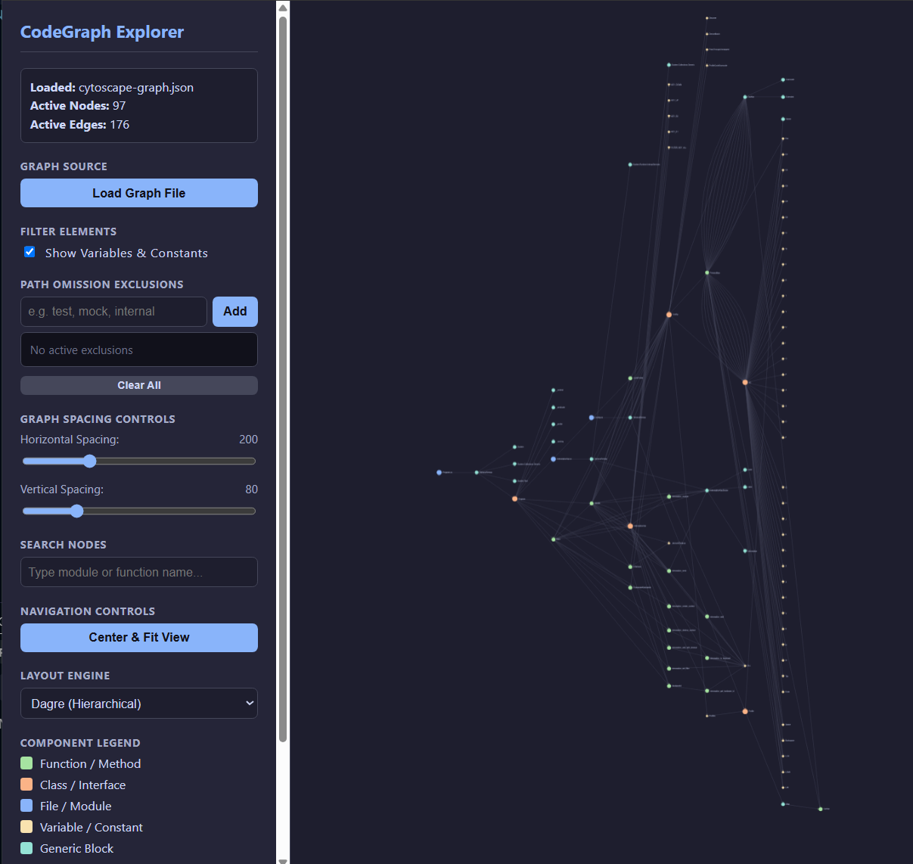
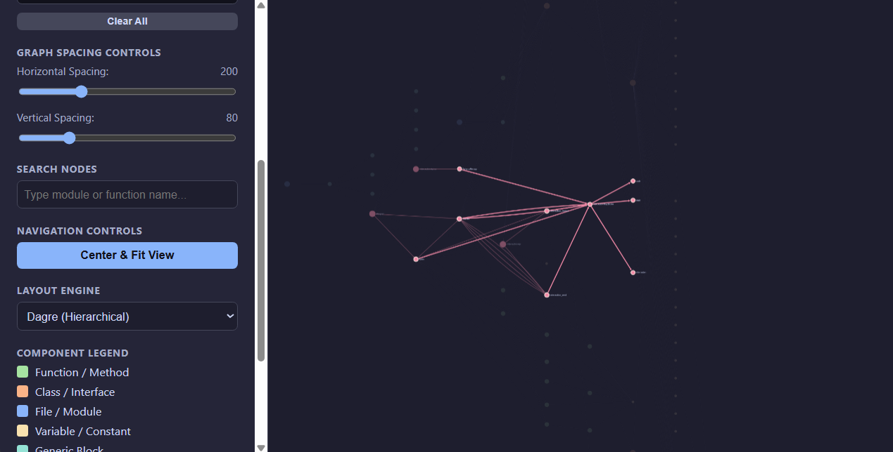
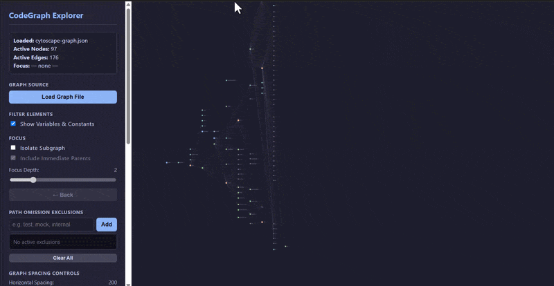

# CodeGraph Explorer

Turns a CodeGraph `codegraph.db` index into a Cytoscape.js JSON graph and serves a small browser
UI for exploring it.

Two pieces:

- `export-cytoscape.js` — Node script. Reads `import/codegraph.db` (read-only) and writes
  `cytoscape-graph.json`.
- `index.html` + `app-visualizer.js` — browser UI that loads and renders user-provided
  `cytoscape-graph.json` files with Cytoscape.js.



## A big thank you to Cytoscape

This project is a thin shell around [**Cytoscape.js**](https://js.cytoscape.org/), and it exists at
all because of the [**Cytoscape**](https://cytoscape.org) community's decades of open source work.
Every graph on this page is theirs — the layout engines, the hit detection, the styling system, the
rendering. Our contribution is the part that reads a SQLite file.

That debt is worth stating plainly, because Cytoscape's reach goes far past drawing call graphs. It
grew up in systems biology, and its open tools have become part of how researchers actually see
living systems: gene and protein interaction networks, regulatory and signaling pathways, and the
tangled rewiring that turns an ordinary cell into a rampaging cancer. Work stretching from the
simplest genomes to the hardest questions in oncology has been done on top of software the Cytoscape
Consortium and the Bader Lab chose to give away.

Pointing it at a codebase is a small thing next to that. If this tool is useful to you, go and look
at what Cytoscape is really for: **<https://cytoscape.org>**

## Requirements

- Node.js 20+ (developed on v24)
- A `codegraph.db` produced by CodeGraph indexing the repo you want to look at

## Setup

```bash
npm install
```

This installs `sqlite3` (used by the exporter) plus `cytoscape` and `cytoscape-dagre`.

Run the unit tests with:

```bash
npm test
```

This runs `node --test`, which covers the focus-mode graph traversal in
`subgraph.js`. No test framework is installed — `node:test` ships with Node.

The browser page loads Cytoscape from vendored copies at the repo root rather than from
`node_modules`, so the static server doesn't need to expose `node_modules`. Those copies are
checked in; refresh them after upgrading the dependencies:

```bash
cp node_modules/cytoscape/dist/cytoscape.min.js ./cytoscape.min.js
cp node_modules/cytoscape-dagre/dist/cytoscape-dagre.min.js ./cytoscape-dagre.js
```

## Usage

1. Copy the CodeGraph database of the project you want to explore into `import/`:

   ```bash
   mkdir -p import
   cp /path/to/your-project/.codegraph/codegraph.db import/
   ```

   The path is hardcoded to `import/codegraph.db` relative to the current working directory.

2. Export:

   ```bash
   node export-cytoscape.js
   ```

   Writes `cytoscape-graph.json` and prints how many nodes and edges were kept versus discarded.

3. Serve and open:

   ```bash
   npx serve .
   ```

   Open the printed URL (usually <http://localhost:3000>). The page opens empty. Load a graph by
   dragging an exported `cytoscape-graph.json` onto the page, or click **Load Graph File** in the
   sidebar and pick one. You can drop a different file at any time to swap graphs. Because loading
   uses the browser's `FileReader` (not `fetch`), the page also works when opened as a `file://`
   URL, though serving over HTTP works fine too.

   

## What the exporter does

Reads two tables and flattens them into Cytoscape's element format:

| Source | Becomes |
| --- | --- |
| `nodes(id, name, kind, file_path)` | node `data`: `id`, `label`, `kind` (lowercased), `filePath` |
| `edges(source, target, kind)` | edge `data`: `id` (`edge-N`), `source`, `target`, `relationship` |

Two sanitization rules, because raw indices contain junk that makes Cytoscape throw:

- Nodes with a null, undefined, or blank `id` are dropped.
- Edges are kept only if **both** endpoints survived — orphaned edges are discarded.

## The explorer UI

- **Load Graph File / drag-and-drop** — the page opens empty; load an exported `cytoscape-graph.json`
  by dropping it anywhere on the page or clicking **Load Graph File**. Drop another file at any time
  to swap graphs. The active file name shows next to **Loaded** in the stats box. Invalid files (not
  JSON, or missing `nodes`/`edges`) are rejected without replacing the current graph.
- **Show Variables & Constants** — toggle off to hide `variable`/`constant` nodes, which usually
  dominate the node count.
- **Isolate Subgraph** — off by default; with it off, clicking a node fades the rest of
  the graph as before. Switch it on and clicking a node *prunes* the canvas to that
  node's neighborhood: the anchor, everything within **Focus Depth** generations
  downstream (1–6, default 2), plus its immediate parents when **Include Immediate
  Parents** is on. Clicking any node in the isolated view — descendant or parent —
  re-anchors on it; **← Back** steps to the previous anchor. Direction shows in the
  borders and edges: cream for the anchor, pink downstream, mauve upstream. Node fills
  keep their kind colors. Turning the toggle off restores the full filtered graph.
  If a filter or exclusion removes the current anchor, focus clears and says so.

  
- **Path Omission Exclusions** — add substrings (e.g. `test`, `mock`, `vendor`); any node whose
  file path or label contains one is filtered out, along with its edges.
- **Spacing sliders** — horizontal/vertical separation, applied as `rankSep`/`nodeSep` for dagre
  and as `idealEdgeLength`/`nodeRepulsion` for COSE.
- **Search** — centers on the first label match and selects it. The scope selector next
  to the box offers **Full Graph** always, and **Current Subgraph** while a subgraph is
  isolated. Searching the full graph while isolated does not re-anchor as you type —
  it reports the match count and waits for Enter, which anchors on the first match.
- **Layout engine** — Dagre (hierarchical, left-to-right), COSE (force-directed), Grid (fast).
  COSE warns above 500 nodes and warns harder above 1200; on large graphs it will lock the tab
  for several seconds.
- **Click a node** — highlights two generations upstream and downstream, fades the rest, and
  shows kind, total upstream/downstream counts, and file path in the sidebar.



Node colors by kind: function/method green, class/interface orange, file/module blue,
variable/constant yellow, everything else teal.

Filtering is what makes a large index readable — hiding variables and excluding a few path
substrings usually cuts the node count by more than half:



## Repo layout

```
export-cytoscape.js     exporter (db -> json)
index.html              explorer page + styles
app-visualizer.js       explorer logic
subgraph.js             focus-mode graph traversal (pure, no DOM)
subgraph.test.js        node:test coverage for subgraph.js
cytoscape.min.js        vendored dependency
cytoscape-dagre.js      vendored dependency (the .min build, renamed)
cytoscape-graph.json    generated output
import/                 your copied database (gitignored)
docs/images/            README screenshots
```

## Notes and limits

- Everything is loaded into memory client-side. `cytoscape-graph.json` for a mid-sized project is
  already over 1 MB; very large indices will be slow before any layout runs.
- The exporter has no CLI arguments — database and output paths are hardcoded.
- `cytoscape-graph.json` is generated output that is currently committed. If you'd rather not
  track it, add it to `.gitignore` and re-run the exporter after cloning.
